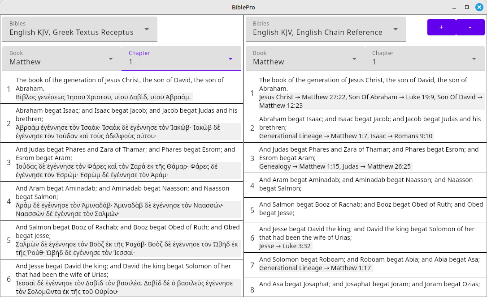

Cross-platform Bible app written in Kotlin Multiplatform Compose

MSI, DEB, and RPM packages are available on the [releases page](releases).

Features:
- Read the Bible in multiple versions.
- Lightning fast search across all your Bibles.
- Built-in Strongs concordance: just click on a word in the original languages to see its Strongs number.
- No internet connections ever.  Not even for downloading Bibles.  All data is stored locally on your device.

Screenshot:

License:  MIT License

Copyright 2025 Edwin Zimmermman

License for all chain reference data:  [ CC BY-NC-SA 4.0 ](https://creativecommons.org/licenses/by-nc-sa/4.0/?ref=chooser-v1)